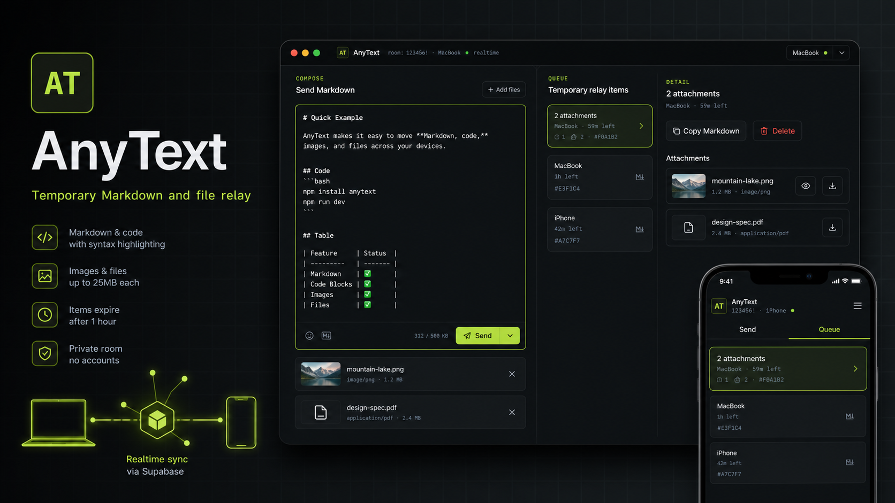
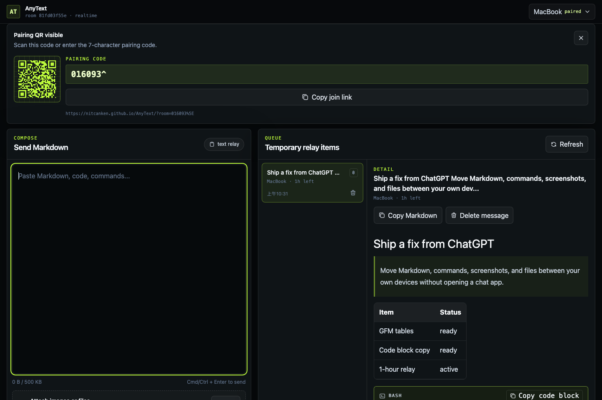
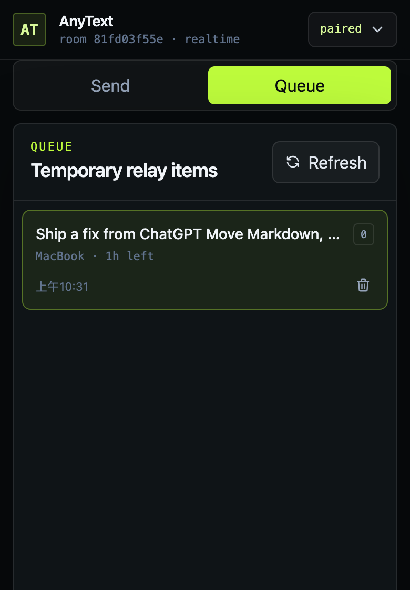

# AnyText

[](https://github.com/NitcanKen/AnyText/actions/workflows/deploy-pages.yml)
[](https://vite.dev/)
[](https://react.dev/)
[](https://www.typescriptlang.org/)
[](LICENSE)

**Temporary Markdown and file relay for your own devices.**

[Live app](https://nitcanken.github.io/AnyText/) · [繁體中文](README.zh-Hant.md)

<p align="center">
  
</p>

AnyText is a lightweight cross-device relay board for developers and technical users who move Markdown, code, commands, screenshots, and files between their own devices. It is built for the small daily gap between "ChatGPT gave me something useful on this device" and "I need it on that other device now."

It is not a notes app, team workspace, chat app, public file-sharing service, or long-term archive. Items are temporary, manually sent, and designed to disappear from the queue after one hour.

## Screenshots

<p align="center">
  
  
</p>

## What It Does

- Pair owned devices once with a QR link or a 7-character code such as `123456!`.
- Send Markdown with GitHub-flavored tables, blockquotes, inline code, and highlighted code blocks.
- Copy the original Markdown or copy an individual code block exactly.
- Attach up to 10 files per message, with a 25 MB limit per file.
- Preview common image files and download other files through scoped signed URLs.
- Keep a temporary room queue with realtime updates, manual delete, and one-hour expiry.
- Run as a static Vite app on GitHub Pages with Supabase for Postgres, Storage, and Realtime.

## Current Status

AnyText is an MVP. The core browser relay is implemented and deployed, including Markdown preview, attachments, Supabase realtime sync, signed downloads, GitHub Pages deployment, and cleanup support.

The project intentionally does not include accounts, collaboration, full-text search, tags, clipboard watching, native apps, browser extensions, public sharing links, or end-to-end encryption.

## Architecture

```text
Browser app
  Vite + React + TypeScript + Tailwind
  Markdown preview, queue UI, local room persistence

Supabase
  Postgres metadata: rooms, messages, attachments
  Restricted RPC boundary for room/message operations
  Private Storage bucket for attachments
  Edge Function for scoped signed download URLs
  Edge Function for expired/deleted object cleanup
  Realtime broadcasts for queue updates

Hosting
  GitHub Pages static deployment
```

Room records use `sha256(roomKey)` as the backend room id. The raw room key is stored only in paired browsers and pairing links/QR codes.

## Security Model

AnyText uses a lightweight shared-secret room model, not an account system.

- New rooms use a short manual pairing code: six digits plus one symbol from `!@#$%^&*`.
- The short code is a deliberate usability tradeoff for fast device pairing.
- The app is not end-to-end encrypted.
- Supabase project administrators can access stored message text and files.
- Do not use AnyText for passwords, private keys, legal/medical secrets, or long-term sensitive storage.
- Message rows and attachments are designed around one-hour expiry and manual deletion.

## Tech Stack

- Vite
- React
- TypeScript
- Tailwind CSS
- Supabase JS
- Supabase Postgres, Storage, Realtime, Edge Functions
- react-markdown, remark-gfm, rehype-sanitize
- prism-react-renderer
- qrcode.react
- Tabler Icons
- Vitest and Testing Library

## Quick Start

Prerequisites:

- Node.js 24 recommended
- npm
- Supabase CLI if you want to run or deploy the backend

```bash
git clone https://github.com/NitcanKen/AnyText.git
cd AnyText
npm ci
cp .env.example .env.local
npm run dev
```

Set these frontend variables in `.env.local`:

```bash
VITE_SUPABASE_URL=https://your-project.supabase.co
VITE_SUPABASE_ANON_KEY=your-anon-or-publishable-key
```

Never put a service role key in any `VITE_*` variable. Vite exposes `VITE_*` values to the browser.

## Supabase Setup

Install and authenticate the Supabase CLI, then link your project:

```bash
supabase login
supabase link --project-ref "$SUPABASE_PROJECT_REF"
supabase db push
```

Deploy the Edge Functions:

```bash
supabase functions deploy anytext-create-download-url
supabase functions deploy anytext-cleanup-expired --no-verify-jwt
```

Set the cleanup invocation token:

```bash
supabase secrets set ANYTEXT_CLEANUP_TOKEN="generate-a-long-random-token"
```

`SUPABASE_URL` and `SUPABASE_SERVICE_ROLE_KEY` are expected in the Edge Function environment. Keep the service role key out of frontend variables, GitHub Pages variables, and committed files.

### Cleanup Schedule

The cleanup function:

1. Finds expired or deleted attachment records.
2. Deletes matching Supabase Storage objects.
3. Deletes attachment records.
4. Deletes expired or deleted messages with no remaining attachments.

Manual invocation:

```bash
curl -X POST "$VITE_SUPABASE_URL/functions/v1/anytext-cleanup-expired" \
  -H "Authorization: Bearer $ANYTEXT_CLEANUP_TOKEN" \
  -H "Content-Type: application/json" \
  -d '{"limit":100}'
```

For production, schedule `anytext-cleanup-expired` in Supabase to run every 5 minutes with the same bearer token.

## GitHub Pages Deployment

The workflow at `.github/workflows/deploy-pages.yml` runs on `main` and executes:

```bash
npm ci
npm run lint
npm test
npm run build
```

Repository settings:

- Pages source: GitHub Actions
- Repository variable: `VITE_SUPABASE_URL`
- Repository secret: `VITE_SUPABASE_ANON_KEY`

The default GitHub Pages base path is `/AnyText/`. Override it with `VITE_BASE_PATH` if you deploy under another path.

## Quality Gates

```bash
npm run lint
npm test
npm run build
```

The test suite covers room helpers, pairing links, Markdown sanitization/rendering, code block copy behavior, attachment validation, Supabase relay mapping, queue expiry, and core app flows.

## Project Structure

```text
src/
  App.tsx                    Command Deck application shell
  components/MarkdownPreview Markdown renderer and code block UI
  lib/anytext.ts             Room, validation, expiry, and attachment helpers
  lib/pairing.ts             Local pairing and join-link helpers
  lib/supabaseRelay.ts       Restricted Supabase RPC/Storage boundary

supabase/
  migrations/                Postgres schema, RPC, RLS, Storage policies
  functions/                 Edge Functions for downloads and cleanup

docs/
  product/                   Requirements and decision log
  technical/                 Technical framework and Supabase notes
  design/                    Command Deck UI and interaction direction
  assets/                    README images
```

## Contributing

Issues and pull requests are welcome. Keep changes aligned with the MVP shape:

- Single-person owned-device relay
- Temporary queue, not permanent storage
- No accounts or team collaboration
- No broad table access from the browser
- Clear validation and test coverage for user-facing behavior

Before opening a pull request, run:

```bash
npm run lint
npm test
npm run build
```

## License

MIT. See [LICENSE](LICENSE).
