# AnyText

[](https://github.com/NitcanKen/AnyText/actions/workflows/deploy-pages.yml)
[](https://vite.dev/)
[](https://react.dev/)
[](https://www.typescriptlang.org/)
[](LICENSE)

**給自己裝置使用的臨時 Markdown 與檔案中轉板。**

[線上版本](https://nitcanken.github.io/AnyText/) · [English](README.md)

<p align="center">
  
</p>

WhatsApp 和 Discord 太像聊天工具，不適合只為了把一段 command、截圖或 ChatGPT 回答搬到自己的另一部裝置。Notion 又太重，很多時候你只是需要一次臨時交接，不需要再開一個 page、workspace 或 database。

AnyText 是一個輕量的跨裝置 relay board，面向開發者和技術使用者。它解決的是很小但很常見的日常斷點：ChatGPT 或某個工具在這部裝置給了你一段 Markdown、命令、截圖或檔案，但你現在需要在另一部自己的裝置上使用。

它不是筆記工具、團隊工作區、聊天工具、公開檔案分享服務或長期資料庫。內容需要手動送出，會進入臨時 queue，並在 1 小時後從 queue 隱藏。

## 截圖

<p align="center">
  
  
</p>

## 功能

<p align="center">
  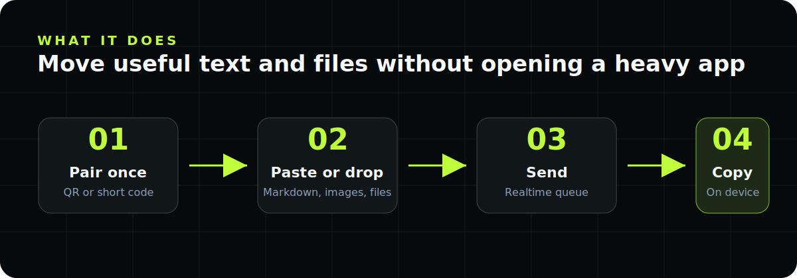
</p>

- 使用 QR link 或 `123456!` 這類 7 字元配對碼，一次配對自己的裝置。
- 傳送支援 GitHub Flavored Markdown 的內容，包括 table、blockquote、inline code 和 syntax-highlighted code block。
- 可複製原始 Markdown，也可單獨精準複製每個 code block。
- 每則訊息最多 10 個附件，每個附件最多 25 MB。
- 常見圖片格式可預覽；其他檔案以 signed URL 下載。
- Queue 支援 realtime 更新、手動刪除與 1 小時過期。
- 前端以 GitHub Pages 靜態部署，後端使用 Supabase Postgres、Storage 和 Realtime。

## 目前狀態

<p align="center">
  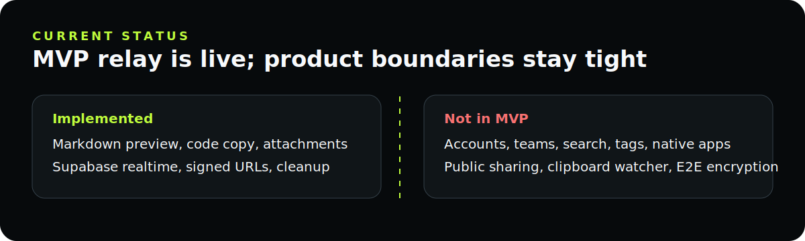
</p>

AnyText 目前是 MVP。核心 browser relay 已完成並已部署，包括 Markdown preview、附件、Supabase realtime sync、signed download、GitHub Pages 部署與 cleanup 支援。

本專案刻意不包含帳戶、協作、全文搜尋、tags、clipboard watcher、native app、browser extension、公開分享連結或 E2E encryption。

## 架構

<p align="center">
  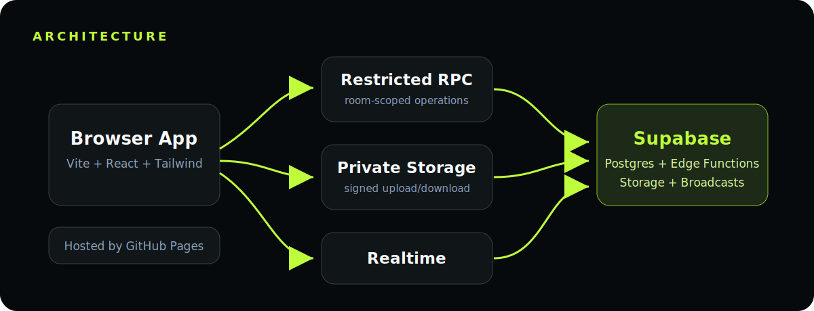
</p>

```text
Browser app
  Vite + React + TypeScript + Tailwind
  Markdown preview, queue UI, local room persistence

Supabase
  Postgres metadata: rooms, messages, attachments
  Restricted RPC boundary for room/message operations
  Private Storage bucket for attachments
  Edge Function for scoped signed download URLs
  Edge Function for expired/deleted object cleanup
  Realtime broadcasts for queue updates

Hosting
  GitHub Pages static deployment
```

後端 room id 使用 `sha256(roomKey)`。原始 room key 只存在於已配對瀏覽器和配對 link/QR code。

## 安全模型

<p align="center">
  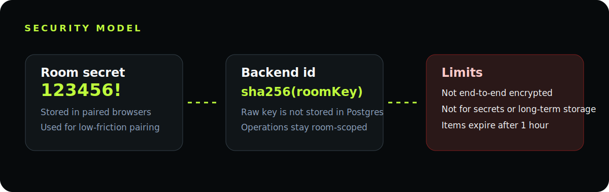
</p>

AnyText 使用輕量 shared-secret room model，不是帳戶系統。

- 新 room 使用短配對碼：6 位數字加 1 個符號，符號來自 `!@#$%^&*`。
- 短配對碼是刻意的 UX/security tradeoff，目標是降低跨裝置入房摩擦。
- AnyText 不是 end-to-end encrypted。
- Supabase project administrators 理論上可以讀取儲存中的文字與檔案。
- 不要用 AnyText 傳送密碼、private keys、法律/醫療秘密，或任何需要長期保護的敏感資料。
- 訊息和附件以 1 小時過期、手動刪除和 cleanup 流程為核心。

## 技術棧

<p align="center">
  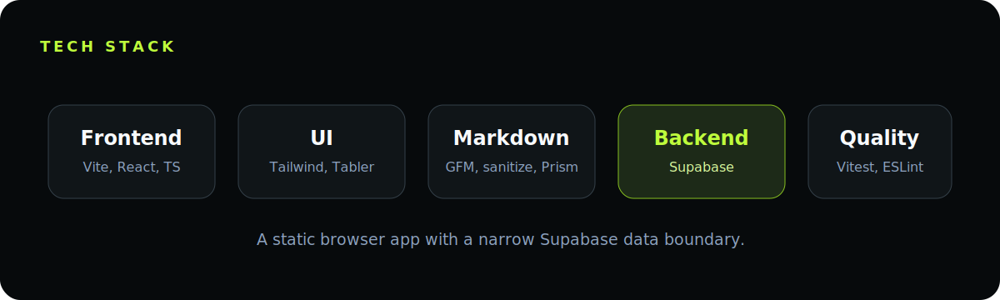
</p>

- Vite
- React
- TypeScript
- Tailwind CSS
- Supabase JS
- Supabase Postgres, Storage, Realtime, Edge Functions
- react-markdown, remark-gfm, rehype-sanitize
- prism-react-renderer
- qrcode.react
- Tabler Icons
- Vitest and Testing Library

## 快速開始

<p align="center">
  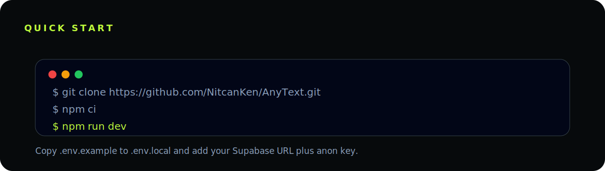
</p>

需求：

- 建議使用 Node.js 24
- npm
- 如果要本機部署或操作後端，需要 Supabase CLI

```bash
git clone https://github.com/NitcanKen/AnyText.git
cd AnyText
npm ci
cp .env.example .env.local
npm run dev
```

在 `.env.local` 設定前端變數：

```bash
VITE_SUPABASE_URL=https://your-project.supabase.co
VITE_SUPABASE_ANON_KEY=your-anon-or-publishable-key
```

不要把 service role key 放進任何 `VITE_*` 變數。Vite 會把 `VITE_*` 暴露到瀏覽器。

## Supabase 設定

<p align="center">
  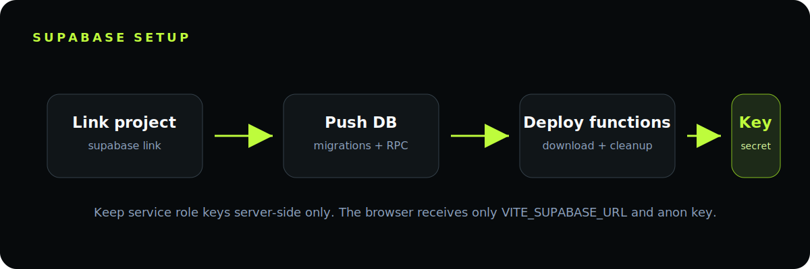
</p>

安裝並登入 Supabase CLI，然後 link project：

```bash
supabase login
supabase link --project-ref "$SUPABASE_PROJECT_REF"
supabase db push
```

部署 Edge Functions：

```bash
supabase functions deploy anytext-create-download-url
supabase functions deploy anytext-cleanup-expired --no-verify-jwt
```

設定 cleanup token：

```bash
supabase secrets set ANYTEXT_CLEANUP_TOKEN="generate-a-long-random-token"
```

Edge Function environment 需要 `SUPABASE_URL` 和 `SUPABASE_SERVICE_ROLE_KEY`。service role key 只應存在於 Supabase/CLI 環境，不應放進前端變數、GitHub Pages variables 或 committed files。

### Cleanup Schedule

<p align="center">
  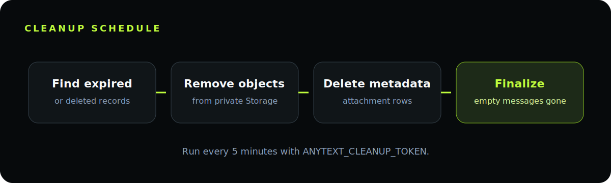
</p>

Cleanup function 會：

1. 找出過期或已刪除的附件 records。
2. 刪除對應的 Supabase Storage objects。
3. 刪除 attachment records。
4. 刪除沒有剩餘附件的過期或已刪除 messages。

手動呼叫：

```bash
curl -X POST "$VITE_SUPABASE_URL/functions/v1/anytext-cleanup-expired" \
  -H "Authorization: Bearer $ANYTEXT_CLEANUP_TOKEN" \
  -H "Content-Type: application/json" \
  -d '{"limit":100}'
```

Production 建議在 Supabase 排程每 5 分鐘呼叫一次 `anytext-cleanup-expired`，並使用同一個 bearer token。

## GitHub Pages 部署

<p align="center">
  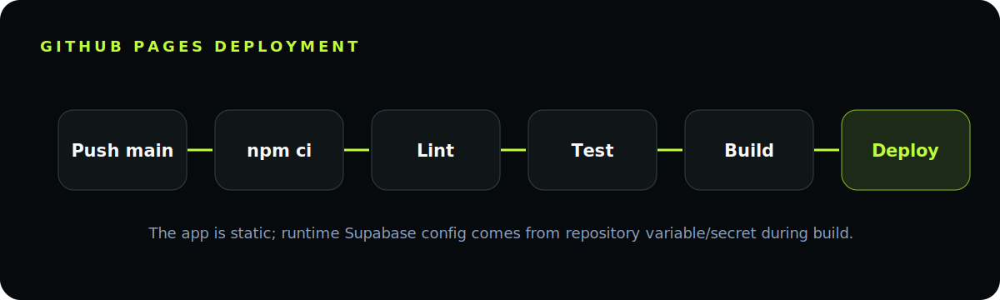
</p>

`.github/workflows/deploy-pages.yml` 會在 `main` push 後執行：

```bash
npm ci
npm run lint
npm test
npm run build
```

Repository settings：

- Pages source: GitHub Actions
- Repository variable: `VITE_SUPABASE_URL`
- Repository secret: `VITE_SUPABASE_ANON_KEY`

預設 GitHub Pages base path 是 `/AnyText/`。如果部署到其他 path，可用 `VITE_BASE_PATH` 覆寫。

## Quality Gates

<p align="center">
  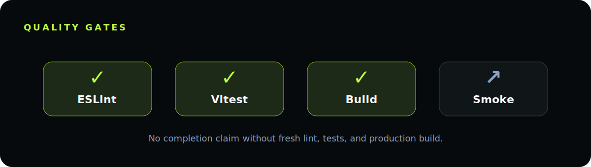
</p>

```bash
npm run lint
npm test
npm run build
```

測試覆蓋 room helpers、pairing links、Markdown sanitization/rendering、code block copy、attachment validation、Supabase relay mapping、queue expiry 和核心 app flows。

## 專案結構

<p align="center">
  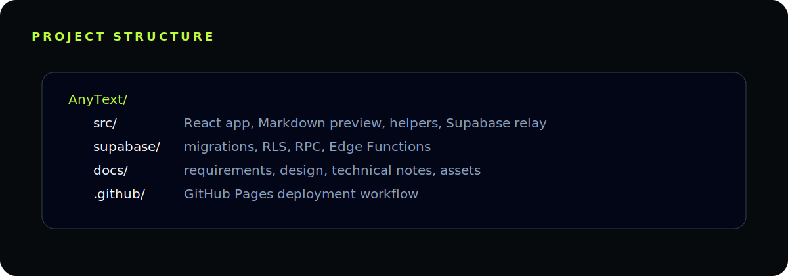
</p>

```text
src/
  App.tsx                    Command Deck application shell
  components/MarkdownPreview Markdown renderer and code block UI
  lib/anytext.ts             Room, validation, expiry, and attachment helpers
  lib/pairing.ts             Local pairing and join-link helpers
  lib/supabaseRelay.ts       Restricted Supabase RPC/Storage boundary

supabase/
  migrations/                Postgres schema, RPC, RLS, Storage policies
  functions/                 Edge Functions for downloads and cleanup

docs/
  product/                   Requirements and decision log
  technical/                 Technical framework and Supabase notes
  design/                    Command Deck UI and interaction direction
  assets/                    README images
```

## Contributing

歡迎 issues 和 pull requests。請保持改動符合 MVP 邊界：

- 單人、自己裝置之間的 relay
- 臨時 queue，不是永久儲存
- 不加帳戶或團隊協作
- 瀏覽器不得擁有 broad table access
- 對使用者可見行為保持清楚 validation 和測試覆蓋

開 PR 前請先執行：

```bash
npm run lint
npm test
npm run build
```

## License

<p align="center">
  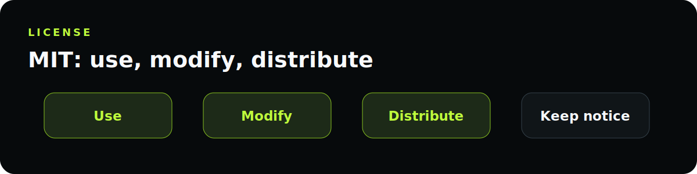
</p>

MIT. See [LICENSE](LICENSE).
